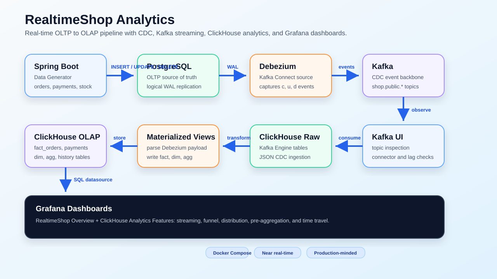
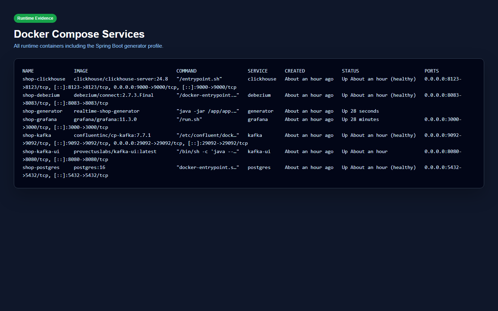
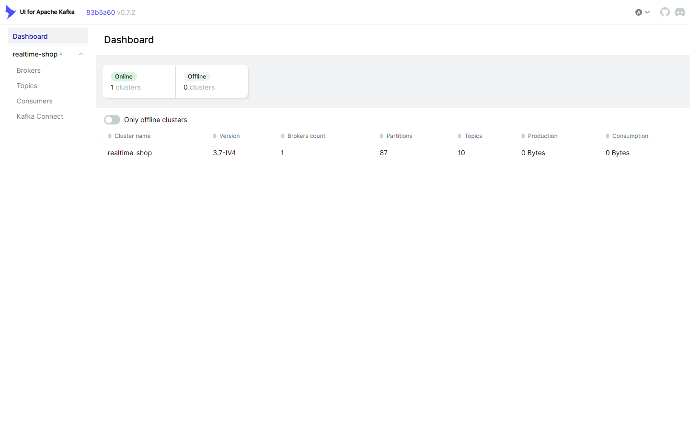
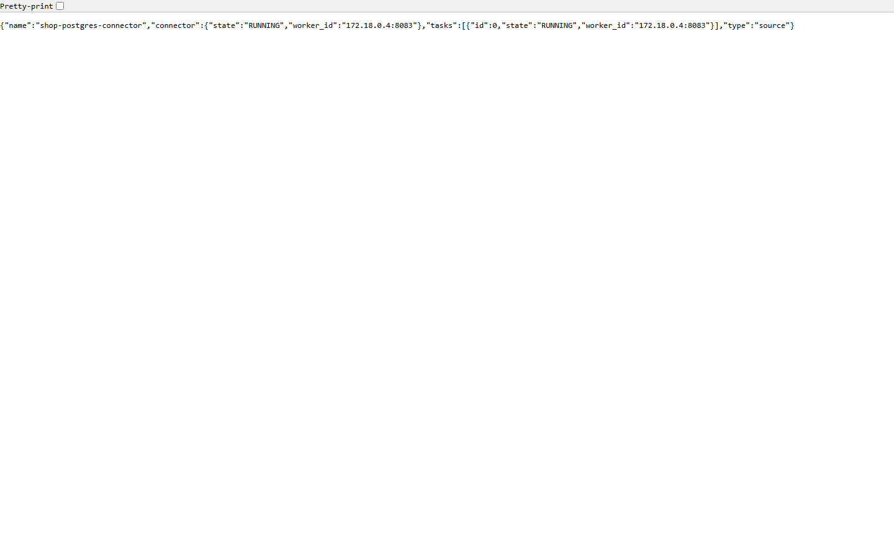
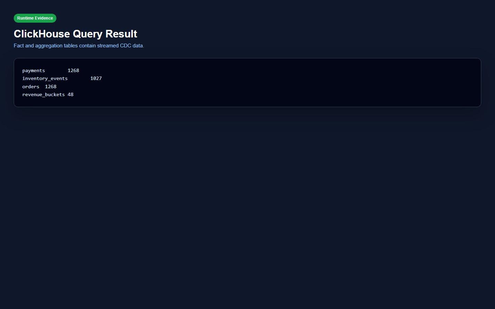
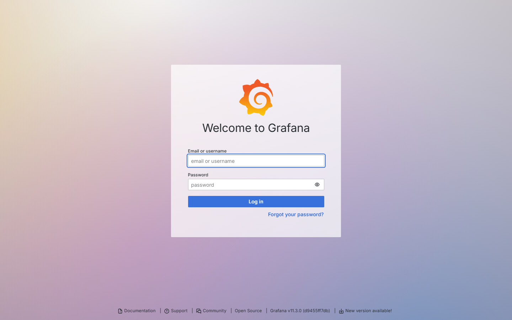
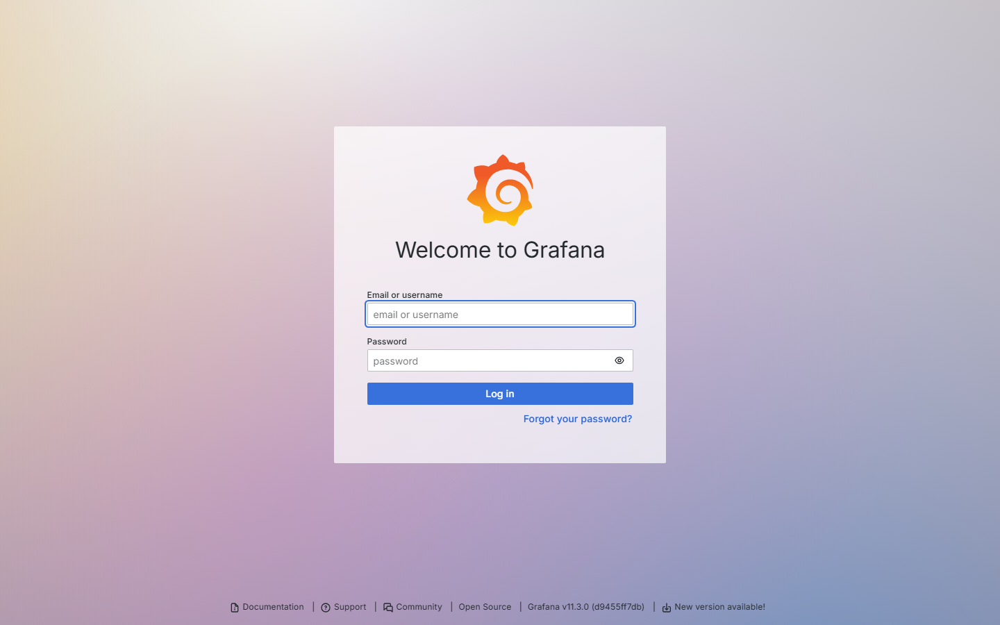

# RealtimeShop Analytics

RealtimeShop Analytics adalah demo **real-time e-commerce analytics platform** yang mengalirkan data transaksi dari PostgreSQL ke ClickHouse menggunakan Change Data Capture (CDC).

Pipeline ini mensimulasikan aplikasi toko online: data order, payment, order item, product, customer, dan inventory event ditulis ke PostgreSQL oleh generator Spring Boot. Debezium membaca perubahan dari WAL PostgreSQL, menerbitkannya ke Kafka, lalu ClickHouse mengonsumsi event tersebut untuk membentuk tabel fact, dimension, aggregation, dan history. Grafana dipakai sebagai dashboard visual.

> CV summary:
> Built a real-time OLTP-to-OLAP analytics pipeline using Spring Boot, PostgreSQL logical replication, Debezium, Kafka, and ClickHouse. Implemented CDC-based synchronization into ClickHouse fact, dimension, aggregation, and history tables with Grafana dashboards for streaming analytics, funnel analysis, approximate distribution, pre-aggregation, and time-travel views.

## Architecture



Alur utama:

```text
Spring Boot Generator
  -> PostgreSQL OLTP
  -> Debezium Kafka Connect
  -> Kafka topics shop.public.*
  -> ClickHouse Kafka Engine raw tables
  -> ClickHouse materialized views
  -> fact / dim / aggregate / history tables
  -> Grafana dashboards
```

## Tech Stack

| Layer | Technology |
| --- | --- |
| Data generator | Spring Boot, Java 21 |
| OLTP source | PostgreSQL 16, logical replication |
| CDC | Debezium Kafka Connect |
| Event backbone | Apache Kafka KRaft |
| OLAP warehouse | ClickHouse |
| Dashboard | Grafana + ClickHouse datasource |
| Observability | Kafka UI, Kafka Connect REST, ClickHouse system tables |
| Orchestration | Docker Compose |

## Implemented Features

| Feature | Implementation |
| --- | --- |
| Basic CDC pipeline | PostgreSQL WAL -> Debezium -> Kafka -> ClickHouse |
| Analytical modeling | `fact_orders`, `fact_payments`, `fact_order_items`, `fact_inventory_events`, `dim_customers`, `dim_products` |
| Pre-aggregation | `agg_revenue_per_minute`, `agg_product_sales_daily`, `agg_payment_status_hourly` |
| Update/delete handling | `ReplacingMergeTree(_version)` and `is_deleted` flag |
| Time travel | `order_status_history` append-only event table |
| Dashboard | Realtime overview and ClickHouse feature showcase in Grafana |
| Observability | Kafka UI, connector status, DLQ config, consumer monitoring |

## ClickHouse Analytics Dashboard

Dashboard **ClickHouse Analytics Features** memperlihatkan 5 kekuatan ClickHouse:

| Section | What it shows |
| --- | --- |
| Streaming | Real-time revenue and order metrics with 5-minute, 15-minute, and 1-hour windows |
| Funnel | Order status flow and payment status conversion |
| Distribution | Approximate unique customers with `uniqHLL12()` and comparison with `uniqExact()` / `uniqCombined()` |
| Pre-Aggregation | Fast dashboard reads from pre-aggregated tables compared with fact table scans |
| Time Travel | Current order state vs state from a past point using `order_status_history` |

Grafana URL:

```text
http://localhost:3000/d/clickhouse-analytics-features/clickhouse-analytics-features
```

Login:

```text
admin / admin
```

## Quick Start

Run from the repository root:

```powershell
cd D:\demoappclickhouse\demo-app-clickhouse
```

Start the main stack:

```powershell
docker compose up -d
```

Register or update the Debezium connector:

```powershell
.\scripts\register-connector.ps1
```

Start the Spring Boot data generator:

```powershell
docker compose --profile generator up -d --build generator
```

Check all services, including the generator profile:

```powershell
docker compose --profile generator ps
```

## Verification Commands

Check Debezium connector status:

```powershell
curl http://localhost:8083/connectors/shop-postgres-connector/status
```

Check Kafka topics:

```powershell
docker exec -it shop-kafka kafka-topics `
  --bootstrap-server kafka:9092 `
  --list
```

Check ClickHouse fact and aggregate tables:

```powershell
docker exec -it shop-clickhouse clickhouse-client `
  -u clickhouse --password clickhouse --database analytics `
  --query "SELECT 'orders' AS metric, count() AS value FROM fact_orders UNION ALL SELECT 'payments', count() FROM fact_payments UNION ALL SELECT 'inventory_events', count() FROM fact_inventory_events UNION ALL SELECT 'revenue_buckets', count() FROM agg_revenue_per_minute"
```

Check real-time revenue:

```powershell
docker exec -it shop-clickhouse clickhouse-client `
  -u clickhouse --password clickhouse --database analytics `
  --query "SELECT * FROM agg_revenue_per_minute ORDER BY minute DESC LIMIT 10"
```

## Runtime URLs

| Service | URL | Purpose |
| --- | --- | --- |
| Grafana | <http://localhost:3000> | Dashboard visualization |
| RealtimeShop Overview | <http://localhost:3000/d/realtime-shop-overview/realtimeshop-overview> | Business analytics dashboard |
| ClickHouse Analytics Features | <http://localhost:3000/d/clickhouse-analytics-features/clickhouse-analytics-features> | Streaming, funnel, distribution, pre-aggregation, time travel |
| Kafka UI | <http://localhost:8080> | Kafka topics, messages, connector visibility |
| Kafka Connect REST | <http://localhost:8083/connectors> | Debezium connector management |
| Connector status | <http://localhost:8083/connectors/shop-postgres-connector/status> | Connector and task state |
| ClickHouse HTTP | <http://localhost:8123> | ClickHouse HTTP endpoint |

## Screenshot Evidence

Screenshot bukti runtime disimpan di [`docs/screenshots`](./docs/screenshots). Jika ingin memperbarui bukti dokumentasi, ambil screenshot baru dengan nama file yang sama.

### 1. Docker Compose Services



### 2. Kafka UI Topics



### 3. Debezium Connector Status



### 4. ClickHouse Query Result



### 5. Grafana RealtimeShop Overview



### 6. Grafana ClickHouse Analytics Features



## Recommended Screenshots for Documentation

| File | Page / command | What to prove |
| --- | --- | --- |
| `01-docker-compose-ps.png` | `docker compose --profile generator ps` | All runtime containers are up |
| `02-kafka-ui-topics.png` | Kafka UI | CDC topics `shop.public.*` exist |
| `03-debezium-connector-status.png` | Kafka Connect connector status | Connector and task are `RUNNING` |
| `04-clickhouse-query-result.png` | ClickHouse query result | Data has landed in fact and aggregate tables |
| `05-grafana-overview.png` | Grafana RealtimeShop Overview | Business dashboard works |
| `06-grafana-clickhouse-features.png` | Grafana ClickHouse Analytics Features | Advanced ClickHouse analytics features work |

## Generator Operations

Stop only the data generator:

```powershell
docker compose stop generator
```

Start the generator again:

```powershell
docker compose --profile generator up -d generator
```

Rebuild and restart the generator:

```powershell
docker compose --profile generator up -d --build generator
```

Watch generator logs:

```powershell
docker logs -f shop-generator
```

## Stop and Reset

Stop the stack but keep volumes:

```powershell
docker compose --profile generator down
```

Reset everything, including PostgreSQL, ClickHouse, and Grafana volumes:

```powershell
docker compose --profile generator down -v
```

## Documentation

Detailed docs:

1. [Architecture](./docs/01-architecture.md)
2. [Data Model](./docs/02-data-model.md)
3. [CDC Pipeline](./docs/03-cdc-pipeline.md)
4. [Roadmap](./docs/04-roadmap.md)
5. [Analytics Queries](./docs/05-analytics-queries.md)
6. [Reliability & Observability](./docs/06-reliability-observability.md)

## Current Status

MVP 1-3 are implemented locally:

- Basic CDC pipeline
- Analytical modeling
- Reliability and observability
- Kafka UI
- Grafana dashboards
- ClickHouse feature showcase
- Runtime screenshot evidence
